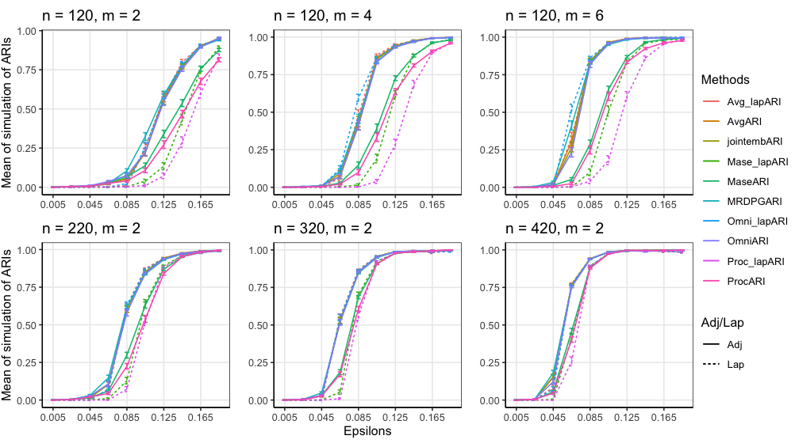
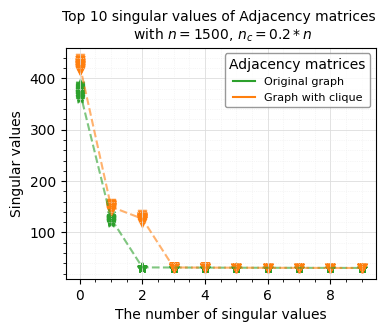

# Hi, I am Tong Qi

I am a PhD candidate in the [Department of Mathematics](https://stat.umd.edu/) at the University of Maryland. I am honored to be advised by [Professor Vince Lyzinski](https://www.math.umd.edu/~vlyzinsk/). 

My research interests are in the areas of graph theory, statistical network analysis, and high-dimensional data analysis. My current work focuses on statistical inference on spectral graph embedding algorithms and their performance comparison.

# Projects
#### 1. Community Detection and Anomaly Detection of Multiple Graph Embedding Methods

<!--https://github.com/tong-qii/tong-qii.github.io/blob/master/assets/img/zebrafish2.png-->

#### 2. Detection of Model-based Planted Pseudo-cliques in Random Dot Product Graphs by the Adjacency Spectral Embedding and the Graph Encoder Embedding
[arXiv:2312.11054](https://arxiv.org/abs/2312.11054)

# Teaching
## Course Instructor 
- Introduction to Math Modeling and Probability (MATH107)  
   &emsp; _Summer 2021; Fall 2020_
- Introduction to Statistical Computing with SAS (STAT430)  
  &emsp; _Fall 2023; Summer 2023; Spring 2023_ 
  
## Discussion Sessions
- Elementary Calculus I (MATH120)    
  &emsp; _Spring 2022_
- Introduction to Probability Theory (STAT410)     
  &emsp; _Fall 2021_
  
  
  
  
 
# Education
🎓 Ph.D. in Mathematical Statistics, 2024  
      &emsp; _University of Maryland_   
🎓 M.S. in Joint Statistics and Computer Science, 2019  
   	 &emsp; _Purdue University_  
🎓 M.S. in Management, 2015   
   	 &emsp; _Purdue University_    
🎓 B.S. in Agricultural Economics, 2013  
   	 &emsp; _Purdue University_  
 

<!--
Text can be **bold**, _italic_, or ~~strikethrough~~.

There should be whitespace between paragraphs. We recommend including a README, or a file with information about your project.

## Header 2

> This is a blockquote following a header.
>
> When something is important enough, you do it even if the odds are not in your favor.

###### Header 6

| head1        | head two          | three |
|:-------------|:------------------|:------|
| ok           | good swedish fish | nice  |
| out of stock | good and plenty   | nice  |
| ok           | good `oreos`      | hmm   |
| ok           | good `zoute` drop | yumm  |

### Small image

### Large image

### Definition lists can be used with HTML syntax.

<dl>
<dt>Name</dt>
<dd>Godzilla</dd>
<dt>Born</dt>
<dd>1952</dd>
<dt>Birthplace</dt>
<dd>Japan</dd>
<dt>Color</dt>
<dd>Green</dd>
</dl>-->
